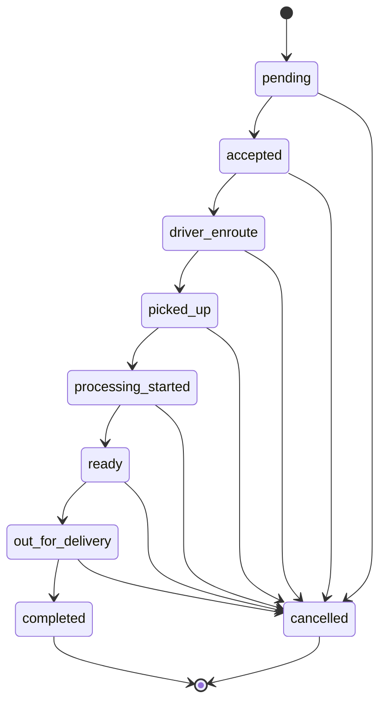

# Delivery Orders

`POST /api/delivery-orders`

Create a new delivery request/order for a customer.

## Status Lifecycle

Delivery orders move through validated statuses and only allow specific transitions.



## Who Calls This

Customers create delivery requests through the public web form. The request must
include the customer's session cookie. Staff/admin can later accept and manage
the delivery order via admin endpoints.

## Authentication

- Create request: customer session required.
- Manage (list/accept/assign/update status): admin/staff with branch permissions.

## Request Body (Create)

```json
{
  "branchCode": "ABC",
  "address": "Street 123, City",
  "pickupTime": "2024-05-01T10:00:00Z",   // optional ISO string
  "dropoffTime": "2024-05-01T15:00:00Z",  // optional ISO string
  "dropoffLat": 24.7136,                   // optional latitude
  "dropoffLng": 46.6753,                   // optional longitude
  "scheduled": false,                      // optional, default false
  "items": [
    { "name": "Shirt", "quantity": 2, "price": 3.5 }
  ]
}
```

`dropoffLat` and `dropoffLng` may be supplied when the address is chosen via the
map interface. When omitted, the server will geocode the provided address.

## Response (Create)

Returns `201` on success:

```json
{ "orderId": "o1", "orderNumber": "ABC-0001" }
```

## GET /api/delivery-orders

Fetch delivery orders. Results are limited to the requester's branch unless the
user is a super admin. Query parameters:

- `status` – filter by delivery status
- `driverId` – filter by assigned driver
- `branchId` – specify branch (super admin only)

```
GET /api/delivery-orders?status=driver_enroute
```

```json
[
  {
    "id": "do1",
    "orderId": "o1",
    "deliveryStatus": "driver_enroute",
    "order": { "id": "o1", "orderNumber": "ABC-0001" }
  }
]
```

## PATCH /api/delivery-orders/:id/accept

Accept a pending delivery request into the branch workflow.

```
PATCH /api/delivery-order-requests/:id/accept
```

Returns the accepted delivery order.

## PATCH /api/delivery-orders/:id/assign

Assign a driver to an existing delivery order. Only branch staff and super
admins may assign drivers.

```
PATCH /api/delivery-orders/o1/assign
{
  "driverId": "user123"
}
```

```json
{
  "id": "do1",
  "orderId": "o1",
  "driverId": "user123",
  "order": { "id": "o1", "orderNumber": "ABC-0001" }
}
```

## PATCH /api/delivery-orders/:id/status

Update the delivery status (`request`, `accepted`, `driver_enroute`,
`picked_up`, `started_processing`, `ready`, `out_for_delivery`, `completed`).
Invalid transitions return `400`.

```
PATCH /api/delivery-orders/o1/status
{
  "status": "out_for_delivery"
}
```

```json
{
  "id": "do1",
  "orderId": "o1",
  "deliveryStatus": "out_for_delivery",
  "order": { "id": "o1", "orderNumber": "ABC-0001" }
}
```

## Realtime

- Subscribe to delivery updates: `GET ws://<host>/ws/delivery-orders`
- Message shape: `{ "orderId": string, "deliveryStatus": string | null, "driverId": string | null }`
- Track driver locations: `GET ws://<host>/ws/driver-location`
- Initial payload includes latest locations; clients may send `{ "driverId", "lat", "lng" }` to update (per deployment policy).
